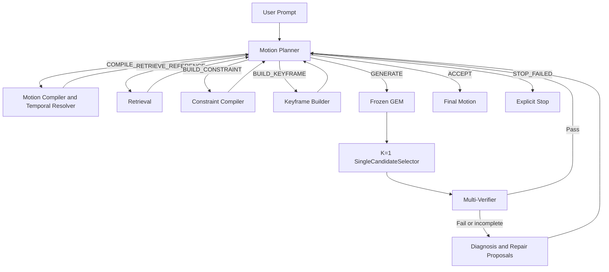
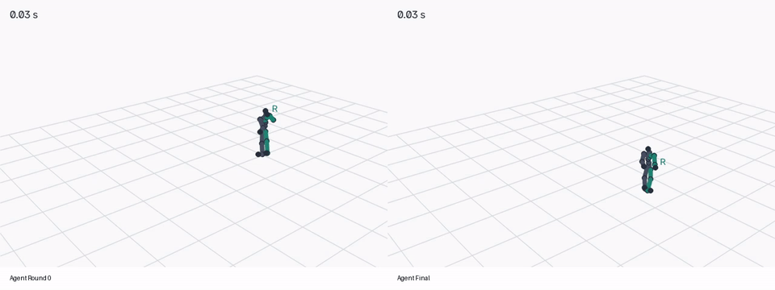
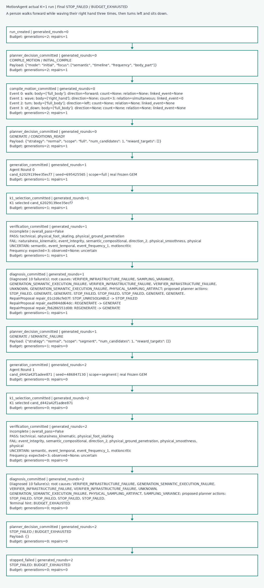

# MotionAgent

Agentic planning, verification, and bounded repair around a frozen text-to-motion generator.

MotionAgent compiles motion requests into structured intent, routes tools, evaluates generated motion, and returns verification-gated `ACCEPT` or explicit `STOP_FAILED`. NVIDIA GEM is the frozen generation tool, not the agent. The Motion Planner owns global control.

[Architecture](#architecture) | [Demo](#demo-verification-guided-motion-repair) | [Quick Setup](#quick-setup) | [Testing](#testing)

## Overview

Direct GEM produces motion from raw text. MotionAgent adds explicit temporal semantics, state, evidence, diagnosis, and legal repair proposals. Diagnosis proposes repairs; the Planner selects exactly one next action. Every repaired candidate must be verified again.

| | Baseline GEM | MotionAgent |
|---|---|---|
| Input | Raw text | Raw text |
| Structured planning | No | Yes |
| Temporal reasoning | Generator only | Explicit structured semantics |
| Verification | No | Multi-Verifier |
| Failure diagnosis | No | Yes |
| Targeted repair | No | Planner-selected proposals |
| Final guard | No | Verification-gated ACCEPT |

This is an architectural comparison, not a benchmark superiority claim.

## Architecture



Current mode is **K=1**. Phase 8 is `BYPASSED_FOR_K1_MODE`; no active Tournament is claimed.

### How It Works

| Component | Responsibility |
|---|---|
| Motion Planner | Selects one structured next action, subject to deterministic guards |
| Motion Compiler | Converts natural language into MotionSpecification |
| Temporal Resolver | Resolves event order, simultaneity, and repetition |
| Retrieval | Supplies reference grounding when its data/index are installed |
| Constraint Compiler | Builds geometric and motion constraints |
| Keyframe Builder | Builds whole-body target poses |
| Frozen GEM | Generates SMPL motion without fine-tuning |
| K=1 Selector | Passes the single candidate to verification |
| Multi-Verifier | Applies task-aware technical, semantic, event, and physical checks |
| Diagnosis / Repair Planner | Explains failures and produces legal RepairProposal objects |
| State / Artifact Store | Tracks typed state, evidence, lineage, and heavy-artifact handles |

The fixed Planner action space is `COMPILE_MOTION`, `RETRIEVE_REFERENCE`, `BUILD_CONSTRAINT`, `BUILD_KEYFRAME`, `GENERATE`, `ACCEPT`, and `STOP_FAILED`. A `PlannerDecision` passes deterministic guards; it is not arbitrary tool execution.

For "Wave the right hand three times," the compiler preserves `expected_count=3`. Required failure or incomplete verification follows `VerificationReport -> Diagnosis -> RepairProposal -> Planner -> generation -> verification`. Failed requirements cannot authorize ACCEPT. Exhausted budgets terminate with STOP_FAILED; repair is not automatically successful.

## Design Principles

- **LLM semantic reasoning:** request interpretation, structured compilation, high-level planning, and optional selective diagnosis. The published demo used rule-first diagnosis, not LLM diagnosis.
- **Deterministic harness:** schemas, guards, budgets, transitions, numerical constraints, physical checks, cache fingerprints, and artifact lineage.
- **Frozen backbone:** control is added around GEM rather than through GEM fine-tuning.
- **Structured state:** task intent and Planner control are separated from execution artifacts and verification/diagnosis evidence. Bounded context comes from canonical state, not chat history as execution truth.

## Demo: Verification-Guided Motion Repair

> A person walks forward while waving their right hand three times, then turns left and sits down.

The actual Phase 11 run used 14 seconds, 420 frames, 30 FPS, K=1, and at most one repair. The real compiler retained walking forward, right-hand waving with count 3, simultaneous walk/wave, a left turn, and sitting. All event ranges were inferred internally.

Planner actions: **COMPILE_MOTION -> GENERATE -> GENERATE -> STOP_FAILED**.

| Stage | Actual result |
|---|---|
| Baseline | One raw-text GEM generation; no Planner or verifier |
| Agent Round 0 | `cand_62029139ee35ecf7`; incomplete report, overall_pass=false |
| Diagnosis and repair | Rule-first diagnosis; Planner chose REGENERATE, normal/segment, targeting all four segments |
| Agent Round 1 | `cand_d442a42f1adee871`; incomplete report, overall_pass=false |
| Final | **STOP_FAILED / BUDGET_EXHAUSTED** |
| Minimal runtime gate | **PASS**: real bounded control loop, not successful prompt execution |

TMR ran twice but lacks a calibrated threshold. Real MLLM evidence could not reliably count waves: **expected 3, observed unknown** in both rounds. Strict MotionCritic did not run because the representation lacks its terminal hand rotations. Kinematic naturalness improved, but other checks still failed and ground penetration regressed. Two original visual-report issues were corrected after this run; the published results preserve the original evidence.



[Baseline](assets/demo/baseline.mp4) | [Agent Round 0](assets/demo/agent_round0.mp4) | [Agent Final](assets/demo/agent_final.mp4) | [Before vs After Repair](assets/demo/repair_comparison.mp4) | [Full Comparison](assets/demo/comparison.mp4)

All videos use synchronized playback, the same fixed camera, background, FPS, and FK22 skeleton renderer. Candidate body shapes are preserved; generated motion was not manually changed. Use MP4 for detail beyond the reduced-resolution GIF.



Actual Phase 11 execution trace, generated from EventLog. [HTML](assets/demo/pipeline_trace.html) may display as source on GitHub. [Detailed demo](docs/phase11_demo.md), [sanitized trace](assets/demo/trace.json), and [run summary](assets/demo/demo_summary.json) contain the evidence and limitations.

## Quick Setup

The real GPU demo used Linux, Python 3.12.3, PyTorch 2.8.0+cu128, CUDA 12.8, and A100 80 GB. CPU tests do not need GEM assets. This is a tested configuration, not a guarantee for every upstream dependency combination.

```bash
git clone https://github.com/shuke0906/MotionAgent.git
cd MotionAgent
python -m venv .venv
source .venv/bin/activate
python -m pip install -r requirements.txt
python -m pip install -r requirements-phase11.txt
cp .env.example .env
```

Windows activation: `.venv\Scripts\Activate.ps1`. Choose a CUDA PyTorch build before installing requirements; see [GPU reproduction details](docs/phase11_demo.md#runtime-setup). Populate `OPENAI_API_KEY` and `OPENAI_MODEL` in private `.env`. For visual verification configure `MLLM_API_KEY` and a vision-capable `MLLM_MODEL`; these are independent settings. [.env.example](.env.example) has empty values only. Never commit credentials.

Install external GENMO and copy the integration patch files:

```bash
git clone https://github.com/NVlabs/GENMO.git vendor/GENMO
git -C vendor/GENMO checkout 16bebf402d8893184249ee206d957b8248cd8310
git -C vendor/GENMO apply ../../integrations/GENMO/compatibility.patch
cp -r integrations/GENMO/gem/. vendor/GENMO/gem/
cp -r integrations/GENMO/scripts/. vendor/GENMO/scripts/
python vendor/GENMO/scripts/download_gvhmr_support.py
python scripts/download_phase11_gem.py
```

Obtain licensed SMPL-X separately. Expected asset paths:

```text
vendor/GENMO/inputs/pretrained/gem_smpl.ckpt
vendor/GENMO/inputs/checkpoints/body_models/smplx/SMPLX_NEUTRAL.npz
```

Sources: [official NVIDIA GEM-X](https://huggingface.co/nvidia/GEM-X), [official SMPL-X registration/download](https://smpl-x.is.tue.mpg.de/). Assets are **not redistributed**. Install TMR/MotionCritic separately using upstream instructions and [configured paths](configs/learned_verifiers.yaml). Install `ffmpeg` on PATH. Full GPU dependencies include GENMO's text encoder assets; consult the detailed setup before running.

```bash
python scripts/smoke_llm_api.py --use-dotenv
python scripts/probe_phase11_backends.py --visual
python scripts/run_phase11_minimal.py
```

The last command runs one GEM smoke, one baseline, then the bounded Agent with at most one repair. It is **not** the full eight-scenario benchmark. Output: ignored `outputs/phase11_real_e2e/`. Existing smoke/baseline artifacts may be reused; use a fresh output directory for a new matched comparison. API and GPU execution incur cost.

## Repository Structure

| Path | Purpose |
|---|---|
| `motion_agent/agent/`, `graph/`, `app/` | Planner, guards, LangGraph orchestration |
| `motion_agent/compiler/` | Structured semantics and temporal resolution |
| `motion_agent/retrieval/`, `constraints/`, `keyframes/` | Grounding and conditioning tools |
| `motion_agent/generation/` | Frozen GEM adapter and candidate persistence |
| `motion_agent/tournament/k1_selector.py` | Single-candidate route |
| `motion_agent/verification/`, `diagnosis/` | Evidence, diagnosis, repair proposals |
| `motion_agent/state/`, `llm/` | Canonical state/artifacts and API abstraction |
| `configs/`, `scripts/`, `tests/` | Configuration, entry points, tests |
| `docs/`, `doc/`, `assets/demo/` | Public docs, implementation guide, real demo |
| `integrations/GENMO/` | Small external GENMO compatibility patch set |

## Testing

```bash
python -m pytest tests --ignore=tests/gpu -q
```

Publication validation: **262 passed, 24 subtests passed**. Local non-GPU unit/contract/integration tests include synthetic fixtures. No new GPU inference or full Phase 11 benchmark was run for publication.

## Current Status

- Phase 3-11 components are implemented; V1 uses K=1 and bypasses Phase 8 Tournament.
- The real minimal loop is validated, but the published candidate was not accepted.
- TMR calibration and exact MotionCritic representation support remain unresolved. Installed weights alone do not certify motion.
- Demo visual prompt v2 issues were fixed afterward and unit-tested, without new real verification.
- FK22 wide-camera skeleton evidence lacks finger detail and reliable wave counts. Retrieval needs separately prepared HumanML3D/TMR data/index assets.
- GPU setup is not a turnkey container or fully locked environment; upstream revisions and model availability can change reproduction.

## Acknowledgements and Third-Party Assets

[NVIDIA GEM / GENMO](https://github.com/NVlabs/GENMO) is the frozen generator. Its inspected license is NVIDIA OneWay Noncommercial; the small integration patch set retains attribution and [the upstream license](integrations/GENMO/LICENSE). The complete GENMO checkout is external.

[TMR](https://github.com/Mathux/TMR), [MotionCritic](https://github.com/ou524u/MotionCritic), and [HumanML3D](https://github.com/EricGuo5513/HumanML3D) are external research dependencies. Respect each upstream license and dataset terms. Weights and licensed SMPL-X are installed separately; no blanket commercial-use license for them is implied.
